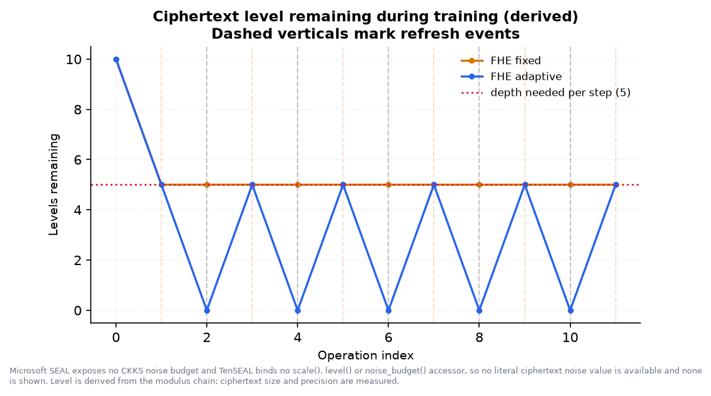

# FHE-TrainNet

**Adaptive, capacity-aware neural-network training on CKKS-encrypted data — and an
honest account of what it costs.**

A working prototype: a neural network is trained on data the training engine
cannot read, and an adaptive controller decides when the ciphertexts need
refreshing. The contribution is the controller and its *measured* evaluation
against a fixed-schedule baseline.

---

## The problem

A data owner holds sensitive records and wants a model trained on them without
revealing them. CKKS makes that possible, and imposes one hard constraint in
return: every homomorphic multiplication consumes part of a finite *modulus
chain*, and when the chain is exhausted the ciphertext is unusable. Restoring
capacity is the most expensive operation in the system.

That turns training into a scheduling problem:

- refresh **too often** and the cost dominates;
- refresh **too late** and the computation fails outright.

**When to refresh** is what this project measures.

## What is real, and what is not

This is stated first because it is the thing an examiner should check.

| | |
|---|---|
| CKKS encryption, decryption, homomorphic arithmetic | **Real** — TenSEAL over Microsoft SEAL |
| Encrypted training — features, labels, weights and bias are all ciphertexts | **Real** |
| The compute zone being unable to decrypt | **Real and verified** — it holds a public-only context; decryption from it raises |
| The capacity metric | **Real** — one derived indicator cross-checked against two measured ones |
| The adaptive controller and every decision it makes | **Real** |
| The refresh primitive being **CKKS bootstrapping** | **No.** SEAL does not implement it |

**Microsoft SEAL does not implement CKKS bootstrapping.** Capacity is restored by
a *client-aided refresh* — the key holder decrypts and re-encrypts — reported
everywhere as `CLIENT-AIDED REFRESH — not CKKS bootstrapping`. Its security
consequence (the owner sees the intermediate weights) is stated, not glossed. Real
`EvalBootstrap` is reachable through the optional OpenFHE backend; see
[`docs/OPENFHE_BACKEND.md`](docs/OPENFHE_BACKEND.md).

Nothing here is copied from documentation. `scripts/probe_library.py` calls every
API and records what happened; [`docs/LIBRARY_CAPABILITIES.md`](docs/LIBRARY_CAPABILITIES.md)
is its output.

## Results

From `results/` on the shipped demo configuration — iris (binary), 100 samples,
degree-3 polynomial activation, CKKS n=16384, 10 usable levels, 5 levels per
training step:

| Mode | Train time | Test accuracy | Refreshes |
|---|---|---|---|
| Plaintext reference | 0.00 s | 0.900 | n/a |
| FHE + fixed policy (every step) | 59.3 s | 0.900 | 11 |
| **FHE + adaptive policy** | **34.3 s** | **0.900** | **5** |

**55% fewer refreshes, 42% faster, identical accuracy.** The
encrypted runs match the plaintext reference exactly, which is the evidence that
the implementation is correct rather than merely fast.

Repeated on the larger dataset with three trials per mode (`configs/benchmark.yaml`
— breast cancer, 8 features, 120 samples), min–max across trials in brackets:

| Mode | Train time | Test accuracy | Refreshes |
|---|---|---|---|
| Plaintext reference | 0.00 s | 0.889 | n/a |
| FHE + fixed policy | 66.7 s (62.3–74.9) | 0.889 | 7 |
| **FHE + adaptive policy** | **39.8 s (39.6–40.2)** | **0.889** | **3** |

**57% fewer refreshes, 40% faster, identical accuracy.** The two ranges do not
overlap — the slowest adaptive trial (40.2 s) still beat the fastest fixed one
(62.3 s), so the difference is the policy and not run-to-run noise.



The fixed policy (orange) sits flat at 5 levels — it refreshes every step and
never uses the lower half of its budget. The adaptive policy (blue) runs the
ciphertext down to 0 before refreshing, because it knows the next step needs
exactly 5 levels.

### The claim, stated carefully

Adaptive does not beat *every* fixed schedule — a correctly tuned one is
competitive. The point is that the correct value has to be found, and that most
values are wrong. `python scripts/run_all_demos.py --demo 7` sweeps it (measured,
on the demo configuration):

| Fixed interval | Refreshes | Time | Outcome |
|---|---|---|---|
| every 1 step | 11 | 78.4 s | works, wastes half its refreshes |
| every 2 steps | 5 | 48.3 s | optimal — if you knew to pick 2 |
| every 3 steps | — | — | **FAILED**: capacity exhausted |
| every 4 steps | — | — | **FAILED**: capacity exhausted |
| **adaptive** | **5** | **43.8 s** | **given no interval at all** |

Two of four plausible intervals fail outright, and the one that works best has to
be derived from the modulus chain, the activation degree and the feature count —
all of which an evaluator can change from the sidebar. The adaptive policy reads
the ciphertext and gets it right in every case.

## Install

Python 3.11+ on Windows, Linux or macOS. No compiler, no Docker, no GPU.

```bash
cd FHE_TrainNet
python -m venv .venv
.venv\Scripts\activate            # Windows
# source .venv/bin/activate       # Linux / macOS
pip install -r requirements.txt

python scripts/probe_library.py   # verify the crypto library, ~10 s
python scripts/build_datasets.py  # write the bundled CSVs (already committed)
```

Verified on Python 3.14.3 / Windows 11 x64 with TenSEAL 0.3.18.

## Run

```bash
# The dashboard - the main deliverable
streamlit run app/dashboard/Home.py

# Demo Mode: plaintext + fixed + adaptive, ~2 minutes
python scripts/run_experiment.py --config configs/demo.yaml

# Benchmark Mode: repeated trials
python scripts/run_experiment.py --config configs/benchmark.yaml

# The control that proves the capacity limit is real (expected to FAIL)
python scripts/run_experiment.py --config configs/no_refresh_control.yaml

# The nine demonstrations, headless
python scripts/run_all_demos.py --list
python scripts/run_all_demos.py --demo 7

# Scaling curves, every point a real run
python scripts/run_scalability.py --axis samples --sizes 20 40 60 80

# Figures and a markdown report from the most recent run
python scripts/make_report.py

# Tests
python -m pytest -q

# Check the project against its own claims (section 25 checklist as a program)
python scripts/validate.py

# Low-memory profile (batch 1, no rotation keys) - what hosted deployments use
python scripts/run_experiment.py --config configs/cloud.yaml

# Optional: real CKKS bootstrapping via OpenFHE in Docker
python scripts/openfhe_backend.py --probe
```

Override any setting without editing a file:

```bash
python scripts/run_experiment.py --config configs/demo.yaml --set epochs=3 learning_rate=0.2
```

## The dashboard

Eleven pages. `streamlit run app/dashboard/Home.py`.

| Page | What it shows |
|---|---|
| **Overview** | Configuration, the depth budget, and the probed capability table |
| **Encryption Lab** | A real record → ciphertext → decryption, with measured precision |
| **Computation Lab** | `x·y + x` on ciphertexts, and what each operation costs in levels |
| **Run Experiment** | Live training monitor: levels, decisions, refreshes as they happen |
| **Capacity Monitor** | The three indicators, their provenance, and the consistency check |
| **Bootstrapping Monitor** | Every decision with its reason — continues included |
| **Comparison** | Plaintext vs fixed vs adaptive, with a generated verdict |
| **Scalability** | Runtime, memory and refresh frequency against workload size |
| **History & Export** | Every recorded run; CSV/JSON/YAML export |
| **Faculty Demo** | The full guided sequence, 1–3 minutes |
| **OpenFHE Backend** | Status of the optional container that really bootstraps |

Everything in the sidebar is live: dataset, sample count, activation, learning
rate, batch size, epochs, CKKS parameters, refresh thresholds, modes, trials.
Invalid CKKS parameters are refused with an explanation before anything runs.

## The capacity metric

SEAL exposes **no CKKS noise budget**, and TenSEAL binds no `scale()`, `level()`
or `noise_budget()` accessor — all probed, all `AttributeError`. So this system
reports no "noise percentage". What it reports is
**Ciphertext Level / Remaining Computation Capacity**:

| Indicator | Provenance | What it is |
|---|---|---|
| Levels remaining | **derived** | Counted against the modulus chain. Exact, but our arithmetic — so it is cross-checked. |
| Serialized ciphertext size | **measured** | `serialize()` length. 174 kB per level at the shipped parameters. |
| Canary precision (bits) | **measured** | A known value carried through the same operations. Real CKKS approximation error — 22.8 bits falling to 12.5 over a demo run. |

A calibration table turns a measured byte count back into a measured level. If
that disagrees with the derived count, the run reports a **consistency failure**
rather than absorbing it. On the shipped configuration there are none.

## How training works

Single-layer network, `z = w·x + b`, polynomial activation. Both the data and the
weights are ciphertexts, so the *model* stays encrypted until the owner decrypts
it. Per training step:

```
z     = Σⱼ wⱼ · Xⱼ + b        ct×ct              1 level
a     = polyval(z, coeffs)    activation         d levels   (d = 2 for degree 3)
delta = a − y                 free               0
gⱼ    = (delta · Xsⱼ).mm(1)   ct×ct + reduction  2 levels
wⱼ   ← wⱼ − gⱼ                free               0
                                          total: 3 + d
```

The learning rate and batch size are folded into a second, pre-scaled encryption
of the features, produced once at depth 0 — which removes one modulus level from
every step. The packing and reduction strategy was chosen by measurement; see
[`docs/ARCHITECTURE.md`](docs/ARCHITECTURE.md).

The plaintext baseline runs the identical algorithm with identical seeds, so any
accuracy difference is attributable to CKKS approximation and nothing else. A test
asserts the two agree to within the arithmetic's own precision.

## Testing

```bash
python -m pytest -q        # 141 tests, no skips
python scripts/validate.py # environment, crypto, honesty and test checks
```

Covering dataset loading and validation, preprocessing, key generation,
encryption/decryption, homomorphic arithmetic, polynomial evaluation, capacity
monitoring, both decision policies, metric recording, configuration round-trips,
export, and figure construction.

Three of them exist specifically to protect claims that would fail *silently*:

- `test_client_aided_refresh_is_never_labelled_bootstrapping` and a source scan
  for any claim that SEAL supports bootstrapping;
- `test_results_file_keeps_unmeasured_quantities_null` — a quantity that was never
  measured must be `null`, never `0`;
- `test_creating_a_key_zone_writes_nothing_to_disk` and a scan of every generated
  artifact for key material.

The refresh policies are tested with no cryptography at all, because the
specification requires the controller to be verifiable where the backend cannot
bootstrap.

## Troubleshooting

**`ParameterError: scale_bits=21 is below the usable floor`** — working as
intended. At that scale, `1.5 × 2.0` was measured returning `3.52` while raising
nothing. Raise `scale_bits`, or shorten the chain so larger primes fit.

**`coeff_mod_bit_sizes sums to N bits, above the ceiling`** — the 128-bit security
limit for that ring dimension. Shorten the chain or raise `poly_modulus_degree`
(the message says which).

**A run FAILED with "exhausted the ciphertext's computation capacity"** — the
refresh policy did not fire in time. Expected for `no_refresh_control`, and for a
fixed interval set too long. Lower `baseline_interval` or use adaptive.

**"the pre-activation value reached X, more than twice the range…"** — the
polynomial activation has left the region where it behaves like a sigmoid, and the
gradient has inverted. Lower the learning rate. The accuracy figures for that run
do not represent successful learning; see
[`docs/LIMITATIONS.md`](docs/LIMITATIONS.md) §6.

**First encrypted run is slow** — key generation is 20–35 s at n=16384, almost all
Galois keys. Contexts are cached per parameter set for the life of the process
(in memory only; never written to disk). Later runs in the same dashboard session
skip it.

**Docker errors from `openfhe_backend.py`** — expected unless Docker Desktop is
running. The backend reports itself unavailable and never falls back.

## Talking points

1. **The training engine cannot read the training data** — not by policy, by
   construction. It holds a public-only context. A test asserts decryption raises.
2. **Additions are free; multiplications are not.** That asymmetry is the entire
   engineering problem, and the Computation Lab shows it in two clicks.
3. **The capacity chart is the contribution.** A flat line against a sawtooth —
   same work, half the refreshes, identical accuracy.
4. **The honest limits are the credibility.** No bootstrapping, no noise
   percentage, no invented numbers — each one evidenced by a probe that failed.
5. **Adaptive's advantage is that it needs no tuning.** A perfectly tuned fixed
   interval ties it; the point is that the right value changes and adaptive finds
   it anyway.

## Documentation

- [`QUICKSTART.md`](QUICKSTART.md) — three commands to a running dashboard
- [`docs/DEPLOYMENT.md`](docs/DEPLOYMENT.md) — hosting it, and the memory constraint that shapes how
- [`docs/ARCHITECTURE.md`](docs/ARCHITECTURE.md) — design, trust boundary, packing decisions
- [`docs/LIMITATIONS.md`](docs/LIMITATIONS.md) — **read before drawing conclusions**
- [`docs/LIBRARY_CAPABILITIES.md`](docs/LIBRARY_CAPABILITIES.md) — generated capability evidence
- [`docs/DEMO_SCRIPT.md`](docs/DEMO_SCRIPT.md) — the 5–10 minute faculty walkthrough
- [`docs/OPENFHE_BACKEND.md`](docs/OPENFHE_BACKEND.md) — real bootstrapping via Docker
- [`datasets/README.md`](datasets/README.md) — dataset card and how to substitute your own

## Basis

Built to the project SRS and Technical Design, which take *ReBoot: Encrypted
Training of Deep Neural Networks Using CKKS* as their research foundation and CKKS
(Cheon–Kim–Kim–Song) as the scheme.
